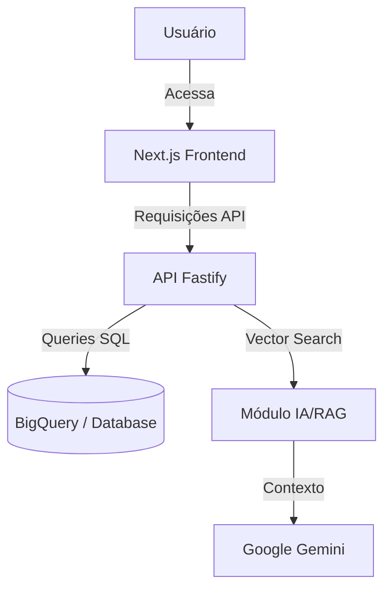

# 🏫 InfoSchool

> **Democratizando o acesso aos dados da educação básica brasileira.**

[](https://github.com/unb-mds/2025-2-InfoSchool/releases)
[](#)
[](https://github.com/unb-mds/2025-2-InfoSchool/actions/workflows/ci.yml)
[](LICENSE)
[](https://github.com/unb-mds/2025-2-InfoSchool/issues?q=is%3Aissue+is%3Aclosed)
[](https://github.com/unb-mds/2025-2-InfoSchool/graphs/contributors)

---

## 📑 Índice

- [📍 Sobre o Projeto](#-sobre-o-projeto)
- [🚀 Funcionalidades](#-funcionalidades)
- [🏗 Arquitetura](#-arquitetura)
- [🛠 Tecnologias](#-tecnologias)
- [📦 Instalação e Execução](#-instalação-e-execução)
- [📂 Estrutura do Projeto](#-estrutura-do-projeto)
- [🤝 Como Contribuir](#-como-contribuir)
- [👥 Equipe](#-equipe)
- [📄 Licença](#-licença)

---

## 📍 Sobre o Projeto

O **InfoSchool** é uma plataforma *open source* desenvolvida para simplificar a visualização e análise do **Censo Escolar da Educação Básica**.

### 📉 O Problema
Os dados do Censo Escolar (INEP) são extremamente ricos, mas distribuídos em arquivos de microdados complexos que dificultam a leitura por pessoas sem conhecimento técnico avançado. Pais, jornalistas e gestores muitas vezes não conseguem extrair insights rápidos sobre a qualidade das escolas.

### 📈 A Solução
Nossa plataforma ingere esses dados, realiza o tratamento e os expõe através de **dashboards interativos** e um sistema de **Busca Conversacional**, permitindo que qualquer pessoa faça perguntas em linguagem natural sobre as escolas do Brasil.

**Público-Alvo:**
* 👪 **Pais e Responsáveis:** Para escolherem a melhor escola baseada em dados reais.
* 🏛 **Gestores Públicos:** Para análise de indicadores regionais.
* 🎓 **Pesquisadores:** Acesso facilitado a dados tratados e enriquecidos.

---

## 🚀 Funcionalidades

- [x] **Ingestão de Dados:** Tratamento automatizado dos microdados do Censo Escolar (INEP).
- [x] **Dashboards:** Visualização de indicadores principais de qualidade e infraestrutura.
- [x] **Busca Conversacional:** Chatbot (RAG) para perguntas em linguagem natural sobre os dados.

---

## 🏗 Arquitetura

O sistema utiliza uma arquitetura moderna focada em componentização e análise de dados escalável.


---

## 🛠 Tecnologias

As principais ferramentas utilizadas no desenvolvimento do InfoSchool:

### Front-end


### Back-end & Dados


---

## 🧪 Qualidade e Testes

Garantimos a estabilidade e confiabilidade do InfoSchool através de uma estratégia rigorosa de testes automatizados.

### Estratégia de Testes

* **Backend:** Utilizamos Jest + Supertest com Fastify Inject para testes de integração de alta performance. Mockamos serviços externos (BigQuery, Google AI) para garantir testes determinísticos e sem custos de nuvem.
* **Frontend:** Testes de componentes com React Testing Library e Jest, garantindo que a interface renderiza corretamente e é acessível.
* **CI/CD:** Pipeline automatizado via GitHub Actions que roda linter, build e testes a cada Pull Request, impedindo regressões na branch main.

---

## 📦 Instalação e Execução

Siga os passos abaixo para rodar o projeto localmente.

### Pré-requisitos
* **Node.js** (Versão 18.x ou superior)
* **Git**
* Gerenciador de pacotes (**npm**)

### Passo a Passo

1. **Clone o repositório:**
   git clone [https://github.com/unb-mds/2025-2-InfoSchool.git](https://github.com/unb-mds/2025-2-InfoSchool.git)

2.  **Acesse a pasta do projeto:**

    ```bash
    cd 2025-2-InfoSchool
    ```

3.  **Instale as dependências:**

    ```bash
    npm install
    ```

4.  **Configuração de Ambiente (.env):**
    Crie um arquivo `.env.local` na raiz da pasta do backend baseando-se no exemplo (`.env.example`) e adicione suas credenciais do BigQuery/Google Cloud/Gemini API.
    ```bash
    cd backend/
    ```
    ```bash
    # .env.example
    GOOGLE_CLOUD_PROJECT=#O ID do projeto no Google Cloud Console
    GOOGLE_API_KEY=# A chave da API do GOOGLE GEMINI
    GOOGLE_APPLICATION_CREDENTIALS=# Credenciais do Google BigQuery
    ```

6.  **Execute o projeto:**
    Volte a pasta raiz do projeto
    ```bash
    cd ..
    ```
    Execute o projeto
    ```bash
    npm run dev
    ```

O projeto estará disponível em: `http://localhost:3000`

-----

## 📂 Estrutura do Projeto

A organização das pastas segue o padrão de separação de responsabilidades:

```

└── 📂 2025-2-InfoSchool/
    ├── 📂 .github/                       # Templates de Issues, PR e Workflows (CI/CD)
    │   ├── 📂 ISSUE_TEMPLATE/
    │   ├── 📂 workflows/
    │   └── 📄 pull_request_template.md
    │
    ├── 📂 backend/                       # Aplicação Principal (Node.js)
    │   ├── 📂 src/
    │   │   ├── 📂 config/
    │   │   └── 📂 controllers/
    │   │   └── 📂 routes/
    │   │   └── 📂 services/
    ├── 📂 docs/                          # Documentação (Arquitetura, Atas, Design)
    │   ├── 📂 Arquitetura back-end/
    │   ├── 📂 arquitetura-frontend/
    │   ├── 📂 atas/
    │   ├── 📂 DevOps/
    │   ├── 📂 estudos/
    │   ├── 📂 Figma/
    │   └── 📂 Product Owner/
    │
    ├── 📂 front-end/         # Aplicação Principal (Next.js)
    │   ├── 📂 src/
    │   │   ├── 📂 public/
    │   │   └── 📂 app/
    │
    ├── 📄 CODE_OF_CONDUCT.md # Código de Conduta
    ├── 📄 CONTRIBUTING.md    # Guia de Contribuição
    ├── 📄 LICENSE            # Licença MIT
    └── 📄 README.md          # Documentação Principal
    ├── 📄 commit-msg.sh      # Padrões de commt
    └── 📄 SECURITY.md        # Política de Segurança
```
-----

## 🤝 Como Contribuir

Contribuições são o que fazem a comunidade open source um lugar incrível para aprender, inspirar e criar. Qualquer contribuição que você fizer será **muito apreciada**.

1.  Faça um **Fork** do projeto.
2.  Crie uma **Branch** para sua feature (`git checkout -b feature/NovaFeature`).
3.  Faça o **Commit** de suas mudanças (`git commit -m 'feat: Adiciona nova visualização'`).
      * *Dica: Siga o padrão [Conventional Commits](https://www.conventionalcommits.org/).*
4.  Faça o **Push** para a Branch (`git push origin feature/NovaFeature`).
5.  Abra um **Pull Request**.

Para mais detalhes, leia nosso [Guia de Contribuição](CONTRIBUTING.md).

-----

## 👥 Equipe

|  |  |  |  |  |  |
|----------|----------|----------|----------|----------|----------|
| [Pedro Augusto](https://github.com/macedoPedro20) | [Pedro Gomes](https://github.com/PedroGomes-phgr) | [Davi Ursulino](https://github.com/DaviUrsulino) | [Fábio Alessandro](https://github.com/Fabiovieira05) | [Leonardo Lopes](https://github.com/LeonardoLopesJr) | [João Eduardo](https://github.com/joaoleless)   |

-----

## 📄 Licença

Este projeto está licenciado sob a Licença MIT - veja o arquivo [LICENSE](LICENSE) para mais detalhes.

-----
